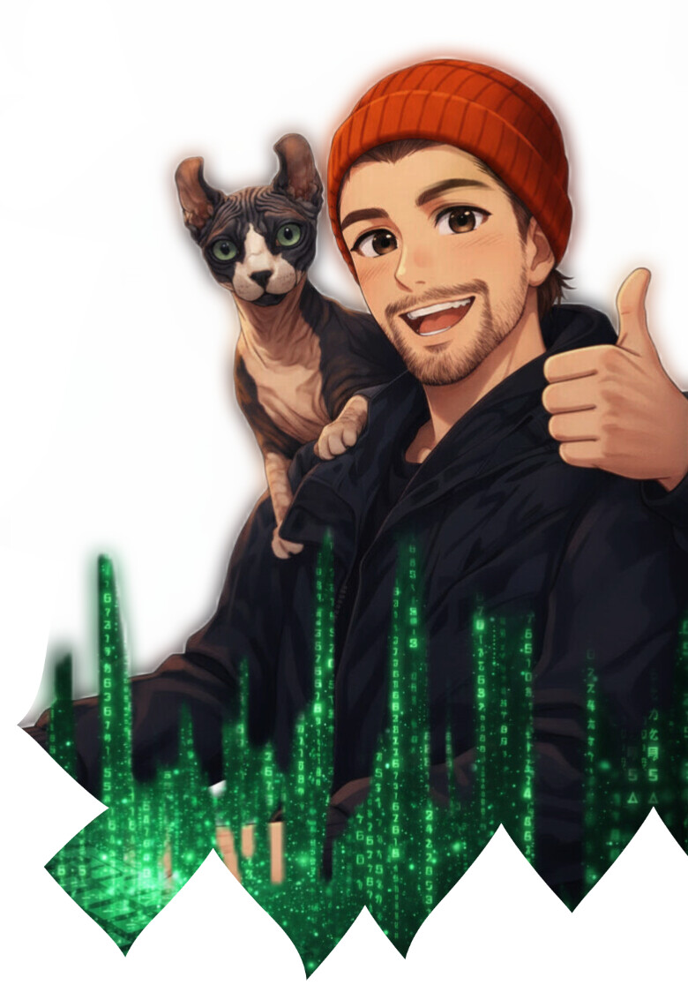

# 

Python developer based in Katowice, Poland. 
<picture>
  <source media="(prefers-color-scheme: dark)" srcset="https://raw.githubusercontent.com/Mateusz-CristalCodeai/githube-readme/output/snake-dark.svg" />
  <source media="(prefers-color-scheme: light)" srcset="https://raw.githubusercontent.com/Mateusz-CristalCodeai/githube-readme/output/snake-light.svg" />
  
</picture>

## About

Role: Python developer
Location: Katowice, Poland
Interests: Biomed, Finance, Code
Currently: Building an app for senior care facilities that helps manage HR resources and analyze medical data.

  </pre>

## What I do

- Build projects that solve real problems
- Experiment with new technologies and keep notes
- I work not only at a desk, byt also directly with people

## Featured projects

| Novaap| Desktop application for managing medical processes with a graphical user interface, touch mode, and a local Bielik chat based on an LLM. | [Python, Qt (Qt Widgets/QML), PostgreSQL, Docker] |

## Tech stack
<table width="100%">
  <tr>
    <td valign="top">
      <strong>Systems & Distros</strong> 
        
      <strong>Languages</strong> 
        
      <strong>Frameworks</strong> 
        
      <strong>Tools</strong> 
      
    </td>
    <td valign="middle" align="right">
      
    </td>
  </tr>
</table>

## Now / Next
-  Working on the release of a medical application  
-  If the launch and sales are successful, I plan to develop more biomedical projects

## Contact

  
  

---

If you want to collaborate, feel free to reach out.
